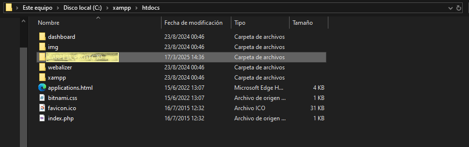
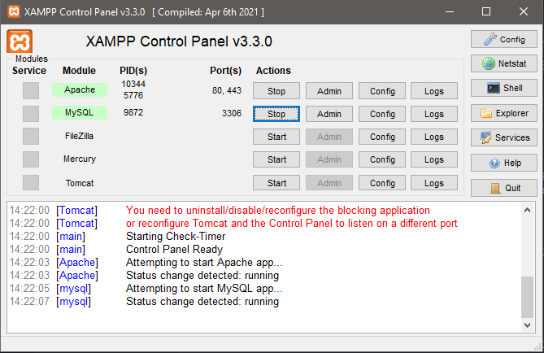
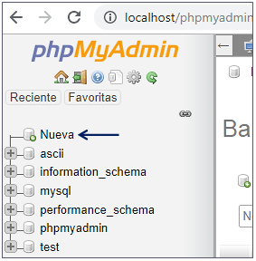
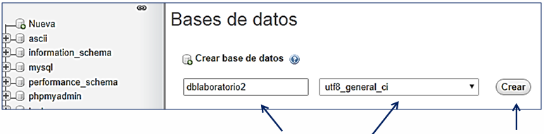

# Sitio web "Comedor Universitario UNT"

_Realizado como trabajo práctico para la asignatura "Laboratorio de software II" de la Universidad Nacional de Tucumán_

## Tecnologías Utilizadas 🛠️

**Wordpress:** con implementación de widgets y plugins; y **Ninjamock** para la creación del boceto.

### Pre-requisitos 📋

* Necesitas un editor de código para poder visualizar y/o editar el código fuente

```
Por ejemplo: Visual Studio Code o Bloc de notas
```

* También necesitamos alguna herramienta de software para interactuar con la base de datos.  

```
Personalmente recomiendo phpmyadmin, ya que es gratuita y escrita en PHP, además de que permite manejar la administración vía Web
```

⬇

Para poder utilizarla, debemos instalar **XAMPP** (Servidor Web Local que admite PHP y MySQL) a través de su [sitio web](https://www.apachefriends.org/download.html). (Recomiendo instalar el programa dentro del disco C:)


### Uso 💻

* Primero accederemos a la carpeta de **XAMPP** a través del explorador de archivos, la ubicación del mismo va a depender de cúal sea la ubicación dada al momento de la instalación del mismo. Una vez ubicada la carpeta, acceder a **xampp>htdocs** y allí colocar la carpeta **c2-Ana-Baigorria** del zip descargado del proyecto, como se muestra en la siguiente imagen.



* Luego debemos importar el archivo **c2anabaigorria.sql** en el sitio web de phpmyadmin. Para ello debemos abrir XAMPP, y encender (apretando el botón de **start**) tanto **Apache** como **MySql** como se muestra en la siguiente captura:



* Ahora ingresaremos a algún navegador como Google Chrome o Microsoft edge y colocaremos en la barra de búsqueda lo siguiente: 'https://localhost/phpmyadmin'

* Una vez allí hacemos click en "Nueva"



* Colocarle como nombre a la Base de Datos "c2anabaigorria" como en la imagen de ejemplo y elegir cotejamiento **utf-8_general_ci**. Luego presionar Crear



* Ahora solo queda escribir en la barra de búsqueda la ruta del proyecto 'localhost/c2-Ana-Baigorria' y ya podremos visualizarlo e utilizarlo funcionalmente.

## Autor/es ✒️

* **Ana Paula Baigorria** - *Desarrollo completo* - [anitabaigorria](https://github.com/anitabaigorria)


## Licencia 📄

Este proyecto está bajo la Licencia (MIT LICENSE) - mira el archivo [LICENSE.md](LICENSE.txt) para detalles
